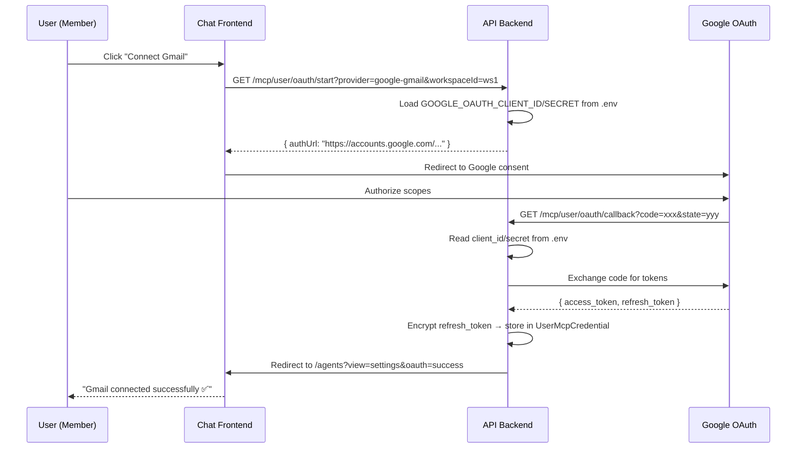
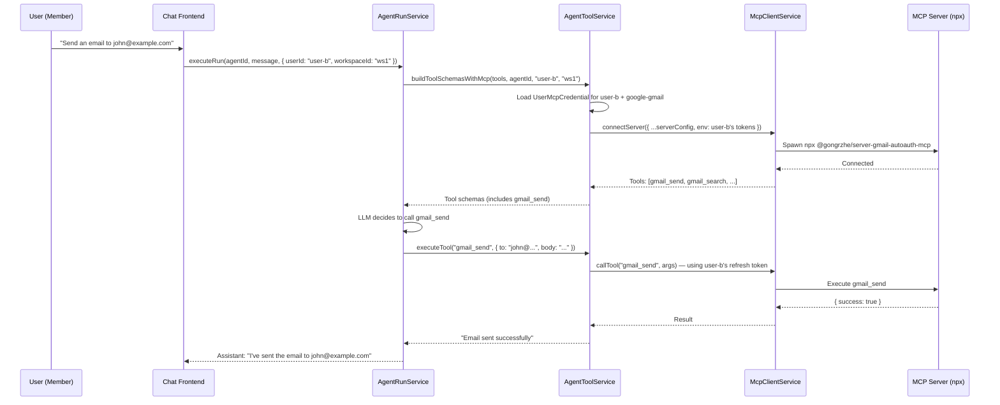

# MCP Per-User Strategy

## Problem Statement

Currently, MCP tool integrations (Gmail, Calendar, Sheets, GitHub, Slack, etc.) are configured at the **admin/workspace level**:

1. An admin stores Google OAuth `client_id` + `client_secret` in `WorkspaceOAuthCredential` (per workspace)
2. When OAuth completes, the resulting `refresh_token` is stored in a single `McpServer` row owned by the admin user (`userId` = admin's ID)
3. The MCP server is auto-attached to all workspace agents
4. **All tool calls (sending emails, reading calendars, writing sheets) execute under the admin's Google account** — not the end-user's

This means if User B uses the workspace agent to send an email, it goes from the **admin's Gmail**, not User B's. Same for Calendar events, Sheets, etc.

---

## Key Simplification: Platform-Level OAuth App Credentials

Instead of having each workspace admin configure their own Google Cloud `client_id`/`client_secret`, we store **one set of OAuth app credentials in `.env`** at the platform level.

```env
# .env — Platform-level OAuth apps (one per provider)
GOOGLE_OAUTH_CLIENT_ID=your-app.apps.googleusercontent.com
GOOGLE_OAUTH_CLIENT_SECRET=your-app-secret
GOOGLE_OAUTH_REDIRECT_URI=https://api.performa.ai/api/v1/mcp/oauth/callback

GITHUB_OAUTH_CLIENT_ID=your-github-app-id
GITHUB_OAUTH_CLIENT_SECRET=your-github-app-secret
GITHUB_OAUTH_REDIRECT_URI=https://api.performa.ai/api/v1/mcp/oauth/callback

SLACK_OAUTH_CLIENT_ID=your-slack-app-id
SLACK_OAUTH_CLIENT_SECRET=your-slack-app-secret
SLACK_OAUTH_REDIRECT_URI=https://api.performa.ai/api/v1/mcp/oauth/callback
```

**Why this is better:**
- Users only need to click "Connect" → authorize → done (no credential setup)
- Standard SaaS pattern (how Notion, Zapier, Linear all work)
- Less error-prone — no risk of users entering wrong client IDs
- You control scopes and security centrally
- `WorkspaceOAuthCredential` table can be **removed entirely**

**One-time requirement**: Submit your OAuth app for Google verification (standard for any SaaS using sensitive scopes like Gmail).

---

## Target Architecture: Per-User MCP Credentials

Each workspace member connects their **own** OAuth accounts. When a user interacts with an agent, the agent uses **that user's** credentials to execute MCP tools.

```
┌─────────────────────────────────────────────────────────────────────┐
│                          Workspace                                    │
│                                                                       │
│  ┌──────────────┐  ┌──────────────┐  ┌──────────────┐               │
│  │  Admin (Owner)│  │  Member A    │  │  Member B    │               │
│  │              │  │              │  │              │               │
│  │ Google ✅    │  │ Google ✅    │  │ Google ❌    │               │
│  │ GitHub ✅    │  │ GitHub ❌    │  │ Slack  ✅    │               │
│  └──────────────┘  └──────────────┘  └──────────────┘               │
│                                                                       │
│  Agent "Executive Assistant"                                          │
│    → Enabled MCP: google-gmail, google-calendar, github               │
│    → At runtime: uses credentials of the USER who is chatting         │
└─────────────────────────────────────────────────────────────────────┘
```

---

## Database Schema Changes

### New Model: `UserMcpCredential`

Stores per-user OAuth tokens for each MCP provider within a workspace.

```prisma
model UserMcpCredential {
  id              String    @id @default(uuid())
  userId          String    @map("user_id")
  user            User      @relation(fields: [userId], references: [id], onDelete: Cascade)
  workspaceId     String    @map("workspace_id")
  workspace       Workspace @relation(fields: [workspaceId], references: [id], onDelete: Cascade)
  provider        String    // "google-gmail" | "google-calendar" | "google-sheets" | "github" | "slack"
  envEncrypted    String    @map("env_encrypted") // AES-256-GCM encrypted JSON with tokens
  status          String    @default("connected") // "connected" | "expired" | "revoked"
  connectedAt     DateTime  @default(now()) @map("connected_at") @db.Timestamptz()
  expiresAt       DateTime? @map("expires_at") @db.Timestamptz()
  createdAt       DateTime  @default(now()) @db.Timestamptz()
  updatedAt       DateTime  @updatedAt @db.Timestamptz()

  @@unique([userId, workspaceId, provider])
  @@index([userId, workspaceId])
  @@index([workspaceId, provider])
  @@map("user_mcp_credentials")
}
```

### Updated Models

```prisma
model User {
  // ... existing fields ...
  mcpCredentials  UserMcpCredential[]
}

model Workspace {
  // ... existing fields ...
  userMcpCredentials UserMcpCredential[]
}
```

### Remove `WorkspaceOAuthCredential`

This table is no longer needed. OAuth app credentials live in `.env` instead.

```sql
-- Migration: drop table
DROP TABLE IF EXISTS "workspace_oauth_credentials";
```

### Keep Existing `McpServer` + `AgentMcpServer`

These still define **which MCP tools are available to agents** (the "catalog"). The new `UserMcpCredential` defines **whose credentials are used at runtime**.

```
McpServer            → "What MCP services exist" (workspace-level catalog)
AgentMcpServer       → "Which services an agent can use + tool filtering"
UserMcpCredential    → "Per-user auth tokens for actually calling the tools" ← NEW
```

---

## Backend Changes

### 1. New Endpoint: User OAuth Connection

```
GET  /api/v1/mcp/user/oauth/start?provider=google-gmail&workspaceId=xxx
GET  /api/v1/mcp/user/oauth/callback  (redirect from OAuth provider)
GET  /api/v1/mcp/user/credentials?workspaceId=xxx  (list user's connected providers)
DELETE /api/v1/mcp/user/credentials/:provider?workspaceId=xxx  (disconnect)
```

#### `mcp-user.controller.ts` (new)

```typescript
@Controller("mcp/user")
@UseGuards(AuthGuard("jwt"))
export class McpUserController {
  constructor(
    private readonly mcpUserService: McpUserService,
    private readonly configService: ConfigService,
  ) {}

  @Get("oauth/start")
  async startOAuth(
    @Req() req,
    @Query("provider") provider: string, // "google-gmail" | "github" | "slack"
    @Query("workspaceId") workspaceId: string,
  ) {
    // Reads client_id/secret from .env (platform-level)
    // Generates OAuth URL with state = { userId, workspaceId, provider }
    const authUrl = await this.mcpUserService.getOAuthUrl(
      req.user.userId,
      workspaceId,
      provider,
    );
    return { authUrl };
  }

  @Get("oauth/callback")
  async oauthCallback(@Query("code") code, @Query("state") state, @Res() res) {
    // Exchanges code for tokens → stores in UserMcpCredential
    await this.mcpUserService.handleOAuthCallback(code, state);
    const frontendUrl = this.configService.get("CHAT_APP_URL");
    return res.redirect(`${frontendUrl}/agents?view=settings&oauth=success`);
  }

  @Get("credentials")
  async listCredentials(@Req() req, @Query("workspaceId") workspaceId: string) {
    return this.mcpUserService.getUserCredentials(req.user.userId, workspaceId);
  }

  @Delete("credentials/:provider")
  async disconnect(
    @Req() req,
    @Param("provider") provider: string,
    @Query("workspaceId") workspaceId: string,
  ) {
    return this.mcpUserService.revokeCredential(req.user.userId, workspaceId, provider);
  }
}
```

### 2. New `McpUserService` — Platform-Level OAuth

```typescript
@Injectable()
export class McpUserService {
  // OAuth app credentials from .env (platform-level, shared across all users)
  private readonly oauthApps: Record<string, { clientId: string; clientSecret: string; redirectUri: string }>;

  constructor(private configService: ConfigService, private prisma: PrismaService) {
    this.oauthApps = {
      google: {
        clientId: configService.get("GOOGLE_OAUTH_CLIENT_ID"),
        clientSecret: configService.get("GOOGLE_OAUTH_CLIENT_SECRET"),
        redirectUri: configService.get("GOOGLE_OAUTH_REDIRECT_URI"),
      },
      github: {
        clientId: configService.get("GITHUB_OAUTH_CLIENT_ID"),
        clientSecret: configService.get("GITHUB_OAUTH_CLIENT_SECRET"),
        redirectUri: configService.get("GITHUB_OAUTH_REDIRECT_URI"),
      },
      slack: {
        clientId: configService.get("SLACK_OAUTH_CLIENT_ID"),
        clientSecret: configService.get("SLACK_OAUTH_CLIENT_SECRET"),
        redirectUri: configService.get("SLACK_OAUTH_REDIRECT_URI"),
      },
    };
  }

  async getOAuthUrl(userId: string, workspaceId: string, provider: string): Promise<string> {
    const oauthProvider = this.getOAuthProvider(provider); // "google-gmail" → "google"
    const app = this.oauthApps[oauthProvider];
    const scopes = this.getScopesForProvider(provider);
    const state = Buffer.from(JSON.stringify({ userId, workspaceId, provider })).toString("base64url");

    // Build provider-specific OAuth URL
    const params = new URLSearchParams({
      client_id: app.clientId,
      redirect_uri: app.redirectUri,
      response_type: "code",
      scope: scopes.join(" "),
      access_type: "offline",
      prompt: "consent",
      state,
    });
    return `https://accounts.google.com/o/oauth2/v2/auth?${params}`;
  }

  async handleOAuthCallback(code: string, stateB64: string): Promise<void> {
    const { userId, workspaceId, provider } = JSON.parse(
      Buffer.from(stateB64, "base64url").toString()
    );

    const oauthProvider = this.getOAuthProvider(provider);
    const app = this.oauthApps[oauthProvider];

    // Exchange code for tokens using platform credentials from .env
    const tokens = await this.exchangeCodeForTokens(code, app.clientId, app.clientSecret, app.redirectUri);

    // Store user's refresh token in UserMcpCredential
    const envEncrypted = this.encryptJson({
      GOOGLE_CLIENT_ID: app.clientId,
      GOOGLE_CLIENT_SECRET: app.clientSecret,
      GOOGLE_REFRESH_TOKEN: tokens.refresh_token,
    });

    await this.prisma.userMcpCredential.upsert({
      where: { userId_workspaceId_provider: { userId, workspaceId, provider } },
      create: { userId, workspaceId, provider, envEncrypted, status: "connected" },
      update: { envEncrypted, status: "connected", connectedAt: new Date() },
    });
  }
}
```

### 3. Modified `AgentToolService` — Runtime Credential Resolution

The critical change: when executing MCP tools, resolve credentials from the **requesting user**, not from the `McpServer` row.

```typescript
// agent-tool.service.ts

async buildToolSchemasWithMcp(
  agentTools: AgentTool[],
  agentId: string,
  executingUserId: string,    // ← NEW: who is chatting
  workspaceId: string,        // ← NEW: which workspace context
  options?: { injectDelegation?: boolean }
): Promise<ToolSchema[]> {
  const schemas = this.buildToolSchemas(agentTools, options);
  
  const agentMcpConfigs = await this.mcpService.getAgentMcpConfigs(agentId);
  
  // Get user's connected credentials
  const userCredentials = await this.prisma.userMcpCredential.findMany({
    where: { userId: executingUserId, workspaceId, status: "connected" },
  });
  const userCredMap = new Map(userCredentials.map(c => [c.provider, c]));

  for (const { config, allowedTools } of agentMcpConfigs) {
    // Check if user has credentials for this provider
    const userCred = userCredMap.get(config.name);
    if (!userCred) {
      // User hasn't connected this service — skip these tools
      // (or include them but mark as "requires_connection")
      continue;
    }

    // Override server env with user's own credentials
    const userEnv = this.decryptJson(userCred.envEncrypted);
    const userConfig: McpServerConfig = {
      ...config,
      id: `${config.id}-user-${executingUserId}`, // unique per user session
      env: userEnv,
    };

    await this.mcpClient.connectServer(userConfig);
    const mcpTools = await this.mcpClient.listTools(userConfig.id);
    // ... filter by allowedTools, convert to OpenAI format
  }

  return schemas;
}
```

### 4. Modified `AgentRunService` — Pass User Context

```typescript
// agent-run.service.ts

async executeAgentRun(agentId: string, userMessage: string, context: RunContext) {
  const { userId, workspaceId } = context;

  const toolSchemas = await this.toolService.buildToolSchemasWithMcp(
    agent.tools,
    agentId,
    userId,         // ← pass executing user
    workspaceId,    // ← pass workspace context
    { injectDelegation: ... },
  );
  // ... rest of run loop
}
```

### 5. Credential Resolution — User-Only (No Fallback)

With platform-level OAuth app credentials, there's no need for a workspace-level fallback. Each user must connect their own account.

```typescript
// Resolution: strict per-user
async resolveCredentials(provider: string, userId: string, workspaceId: string) {
  const userCred = await this.prisma.userMcpCredential.findUnique({
    where: { userId_workspaceId_provider: { userId, workspaceId, provider } },
  });

  if (!userCred || userCred.status !== "connected") {
    return null; // Tool not available — frontend will show "Connect" CTA
  }

  return this.decryptJson(userCred.envEncrypted);
}
```

> **Note**: For shared tools (e.g., a team Slack bot), you can still keep the existing `McpServer.envEncrypted` path as an optional fallback. But for personal tools (Gmail, Calendar, Sheets, GitHub), it's strictly per-user.

---

## Frontend Changes

### 1. New Component: `UserMcpConnections` (Personal Settings)

Location: `apps/chat/src/components/settings/user-mcp-connections.tsx`

Displayed in user's personal settings or workspace member panel. Shows each user their connection status and "Connect" buttons.

```
┌─────────────────────────────────────────────────────────────┐
│  My Integrations                                             │
│  Connect your accounts to use with workspace agents.         │
├─────────────────────────────────────────────────────────────┤
│                                                               │
│  ┌──────────────┐  ┌──────────────┐  ┌──────────────┐       │
│  │ ✅ Gmail     │  │ ✅ Calendar  │  │ ❌ Sheets    │       │
│  │ Connected    │  │ Connected    │  │              │       │
│  │ [Disconnect] │  │ [Disconnect] │  │ [Connect]    │       │
│  └──────────────┘  └──────────────┘  └──────────────┘       │
│                                                               │
│  ┌──────────────┐  ┌──────────────┐                          │
│  │ ❌ GitHub    │  │ ❌ Slack     │                          │
│  │              │  │              │                          │
│  │ [Connect]    │  │ [Connect]    │                          │
│  └──────────────┘  └──────────────┘                          │
│                                                               │
│  ℹ️ Your credentials are encrypted and only used when you     │
│     interact with agents.                                     │
└─────────────────────────────────────────────────────────────┘
```

### 2. New Hooks: `use-user-mcp.ts`

```typescript
// apps/chat/src/hooks/use-user-mcp.ts

export function useUserMcpCredentials(workspaceId: string | null) {
  return useApiQuery<UserMcpCredential[]>(
    ["user-mcp-credentials", workspaceId],
    `/mcp/user/credentials?workspaceId=${workspaceId}`,
    { enabled: !!workspaceId },
  );
}

export function useStartUserOAuth() {
  // Returns an authUrl that the frontend uses to window.location.href redirect
  return useApiMutation<{ authUrl: string }, { provider: string; workspaceId: string }>(
    ({ provider, workspaceId }) =>
      `/mcp/user/oauth/start?provider=${provider}&workspaceId=${workspaceId}`,
    { method: "GET" },
  );
}

export function useDisconnectUserMcp() {
  return useApiMutation<void, { provider: string; workspaceId: string }>(
    ({ provider, workspaceId }) =>
      `/mcp/user/credentials/${provider}?workspaceId=${workspaceId}`,
    { method: "DELETE" },
  );
}
```

### 3. Modified Agent Chat: Runtime "Connect Required" UX

When a user tries to use an agent tool that requires a credential they haven't connected:

```
┌──────────────────────────────────────────────────┐
│  🤖 Agent: I need to access your Gmail to send   │
│  that email, but you haven't connected your      │
│  Google account yet.                             │
│                                                   │
│  [Connect Google Account]                         │
└──────────────────────────────────────────────────┘
```

Backend returns a special tool result:
```json
{
  "type": "credential_required",
  "provider": "google-gmail",
  "message": "User has not connected google-gmail. Please ask them to connect."
}
```

The LLM sees this and responds with a user-facing message + the frontend renders a "Connect" CTA button.

### 4. Modified `WorkspaceIntegrations` Component

Simplified — no admin setup section needed (credentials are in `.env`). Just shows user's personal connections:

```
┌─────────────────────────────────────────────────────────────┐
│  My Integrations                                              │
│  Connect your accounts to use tools with workspace agents.    │
├─────────────────────────────────────────────────────────────┤
│                                                               │
│  ┌──────────────────────────────────────────────────────┐    │
│  │  Google                                               │    │
│  │  ──────                                               │    │
│  │  Gmail:     ✅ Connected  [Disconnect]                │    │
│  │  Calendar:  ✅ Connected  [Disconnect]                │    │
│  │  Sheets:    ❌ Not connected  [Connect]               │    │
│  └──────────────────────────────────────────────────────┘    │
│                                                               │
│  ┌──────────────────────────────────────────────────────┐    │
│  │  Other Services                                       │    │
│  │  ──────────────                                       │    │
│  │  GitHub:    ❌ Not connected  [Connect]               │    │
│  │  Slack:     ❌ Not connected  [Connect]               │    │
│  │  Notion:    ❌ Not connected  [Connect]               │    │
│  └──────────────────────────────────────────────────────┘    │
│                                                               │
│  ℹ️ Your credentials are encrypted and only used when you     │
│     interact with agents. We never access your accounts       │
│     without your action.                                      │
└─────────────────────────────────────────────────────────────┘
```

### 5. Workspace Members View (Admin Panel)

Admins can see which members have connected which services:

```
┌─────────────────────────────────────────────────────────────┐
│  Team Integration Status                                      │
├─────────────────────────────────────────────────────────────┤
│  Member        │ Gmail │ Calendar │ Sheets │ GitHub │ Slack  │
│  ─────────────────────────────────────────────────────────── │
│  admin@co.com  │  ✅   │    ✅    │   ✅   │   ✅   │   ❌  │
│  alice@co.com  │  ✅   │    ✅    │   ❌   │   ❌   │   ✅  │
│  bob@co.com    │  ❌   │    ❌    │   ❌   │   ✅   │   ✅  │
└─────────────────────────────────────────────────────────────┘
```

---

## Migration Plan

### Phase 1: Schema + New Endpoints (Non-breaking)
1. Add `UserMcpCredential` table via Prisma migration
2. Add `.env` vars for Google/GitHub/Slack OAuth app credentials
3. Add new `McpUserController` + `McpUserService`
4. Add `useUserMcpCredentials` hooks
5. Deploy — no behavior change yet

### Phase 2: Frontend Per-User Connection UI
1. Replace `WorkspaceIntegrations` with simplified "My Integrations" panel
2. Remove Google client_id/secret input form (no longer needed)
3. Add simple "Connect" buttons that trigger OAuth redirect
4. Deploy — users can start connecting their own accounts

### Phase 3: Runtime Credential Resolution
1. Modify `AgentToolService.buildToolSchemasWithMcp` to accept `executingUserId`
2. Implement per-user credential resolution in `McpUserService`
3. Add "credential_required" response type for missing connections
4. Modify `AgentRunService` to pass user context
5. Deploy — agents now use per-user credentials

### Phase 4: Cleanup
1. Remove `WorkspaceOAuthCredential` model from Prisma schema
2. Remove `mcp-oauth.controller.ts` and `mcp-oauth.service.ts` (old workspace flow)
3. Remove credential input dialog from frontend (`McpConnectDialog` credential form)
4. Add admin view showing team connection status
5. Add token refresh/expiry background job
6. Migrate existing admin-level MCP server tokens into `UserMcpCredential` for the admin user

---

## Security Considerations

| Concern | Mitigation |
|---------|------------|
| Token isolation | Each user's tokens stored in separate `UserMcpCredential` rows, encrypted independently |
| Cross-user access | `resolveCredentials` always scoped by `executingUserId` — user A can never use user B's tokens |
| Token refresh | Background job refreshes tokens near expiry; marks as "expired" if refresh fails |
| Revocation | User can disconnect at any time; admin can force-revoke via admin panel |
| Platform OAuth app | Single OAuth app in `.env` — users only get individual refresh tokens |
| Google verification | OAuth app submitted for Google review (required for sensitive scopes) |
| Audit trail | Every MCP tool call logged with `executingUserId` in `AgentMessage` metadata |
| Workspace deletion | `onDelete: Cascade` ensures tokens are purged when workspace is deleted |
| Encryption at rest | Same AES-256-GCM as existing `McpServer.envEncrypted` |
| .env security | OAuth client secrets only in server env; never exposed to frontend or stored in DB |

---

## API Contract Summary

### New Endpoints

| Method | Path | Auth | Description |
|--------|------|------|-------------|
| `GET` | `/mcp/user/credentials?workspaceId=x` | JWT (any member) | List user's connected providers |
| `GET` | `/mcp/user/oauth/start?provider=x&workspaceId=x` | JWT (any member) | Start OAuth (any provider) |
| `GET` | `/mcp/user/oauth/callback` | Public (state has userId) | OAuth redirect handler |
| `DELETE` | `/mcp/user/credentials/:provider?workspaceId=x` | JWT (any member) | Disconnect a provider |
| `GET` | `/mcp/admin/team-status?workspaceId=x` | JWT (admin/owner) | View team connection matrix |

### Removed Endpoints

| Method | Path | Reason |
|--------|------|--------|
| `GET` | `/mcp/oauth/google/credentials` | No longer needed — creds in `.env` |
| `POST` | `/mcp/oauth/google/credentials` | No longer needed — creds in `.env` |
| `GET` | `/mcp/oauth/google/start` | Replaced by `/mcp/user/oauth/start` |
| `GET` | `/mcp/oauth/google/callback` | Replaced by `/mcp/user/oauth/callback` |

### Modified Endpoints (Internal)

| Service Method | Change |
|----------------|--------|
| `AgentToolService.buildToolSchemasWithMcp` | New params: `executingUserId`, `workspaceId` |
| `AgentRunService.executeRun` / `executeRunStream` | Pass `userId` + `workspaceId` from run context |
| `McpClientService.connectServer` | Accept per-user config ID to avoid connection conflicts |

---

## Sequence Diagram: User Connects Google



## Sequence Diagram: Agent Uses Per-User Credentials



---

## File Structure (New/Modified)

```
apps/api/src/app/mcp/
├── mcp.module.ts                    # Register new controller + service
├── mcp-client.service.ts            # No change
├── mcp-oauth.controller.ts          # REMOVE (replaced by mcp-user.controller.ts)
├── mcp-oauth.service.ts             # REMOVE (replaced by mcp-user.service.ts)
├── mcp-user.controller.ts           # NEW — user OAuth + credential endpoints
├── mcp-user.service.ts              # NEW — OAuth flows + credential CRUD (reads from .env)
├── mcp-registry.service.ts          # No change
├── mcp.controller.ts                # No change
├── mcp.service.ts                   # Add credential resolution logic
└── dto/
    ├── mcp.dto.ts                   # No change
    └── mcp-user.dto.ts              # NEW — user credential DTOs

apps/chat/src/
├── hooks/
│   ├── use-mcp.ts                   # Keep existing (server catalog)
│   └── use-user-mcp.ts             # NEW — user credential hooks
├── components/
│   ├── settings/
│   │   ├── workspace-integrations.tsx   # SIMPLIFIED — remove credential input form
│   │   └── user-mcp-connections.tsx     # NEW — personal connections panel
│   ├── integrations/
│   │   └── mcp-connect-dialog.tsx       # SIMPLIFIED — just OAuth redirect, no credential form
│   └── chat/
│       └── credential-required-card.tsx # NEW — inline "Connect" CTA in chat
```

---

## Token Refresh Strategy

Google refresh tokens can expire or be revoked. Handle gracefully:

```typescript
// Background cron job: every 6 hours
@Cron("0 */6 * * *")
async refreshExpiringTokens() {
  const expiring = await this.prisma.userMcpCredential.findMany({
    where: {
      provider: { startsWith: "google-" },
      status: "connected",
      expiresAt: { lte: addHours(new Date(), 12) }, // expiring within 12h
    },
  });

  for (const cred of expiring) {
    try {
      const env = this.decryptJson(cred.envEncrypted);
      const newTokens = await this.refreshGoogleToken(env.GOOGLE_REFRESH_TOKEN, ...);
      // Update stored tokens
    } catch {
      await this.prisma.userMcpCredential.update({
        where: { id: cred.id },
        data: { status: "expired" },
      });
      // Notify user to re-connect
    }
  }
}
```

---

## Summary of Key Design Decisions

1. **Platform-level OAuth app in `.env`** — One Google/GitHub/Slack OAuth app for the entire platform. No per-workspace setup. Users just click "Connect" and authorize.

2. **`WorkspaceOAuthCredential` removed** — No longer needed. Client IDs/secrets live in `.env`, never in the database.

3. **Credentials stored per-user, not per-server** — `UserMcpCredential` replaces putting user tokens in `McpServer.envEncrypted`. The `McpServer` table becomes a pure catalog of available services.

4. **No fallback for personal tools** — Gmail, Calendar, Sheets, GitHub always use the executing user's own tokens. No admin account fallback.

5. **Runtime resolution, not pre-attachment** — Credentials are resolved at the moment of agent execution based on `executingUserId`, not statically attached to agents.

6. **Same MCP SDK, same tool discovery** — The MCP server process is identical; only the env vars (tokens) passed to it change per user.

7. **Google verification required** — Submit the OAuth app for Google review once. Standard process for any SaaS with sensitive scopes.
